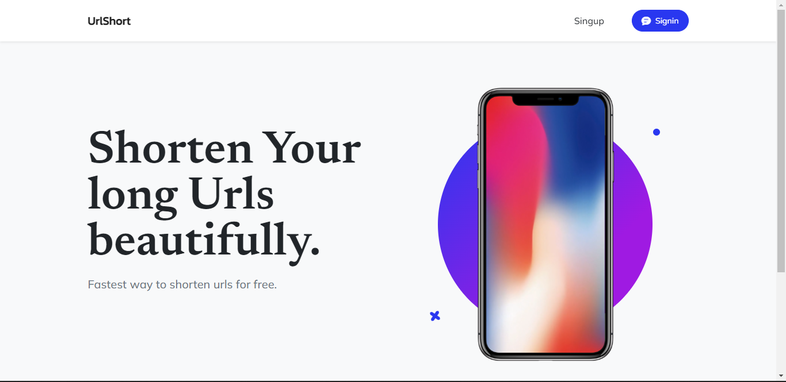

# django-url-shortner
A Functional Django Web App

# Set up
Steps:

1. Clone/pull/download this repository
2. Create a virtualenv with `python -m venv env`
3. Activate virtual environment `source env/bin/activate`
4. Install dependencies with `pip install -r requirements.txt`
5. Comment/remove all Heroku and AWS settings in settings.py inorder for this app to run on local server

### Create superuser
`python manage.py createsuper`

### Finally runserver
`python manage.py runserver`

##  Project Snapshot

# Check The Project link | [Offical website link](https://djshort.herokuapp.com/)
  ## [LINK](https://djshort.herokuapp.com/)

## Note
1. This project hasn't been connected to a domain yet, it runs on heroku
2. This project is for my portfolio use only 
3. You can clone and use this project for eductional purposes
4. Functionalities such as allauth login, links statistics and more would be added in the near future(or not :) )

## Contact me
 ### Youngkhito@gmail.com
 ### Website and Social links coming soon.
 
 
